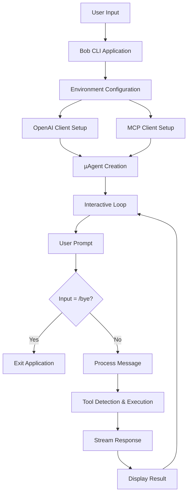
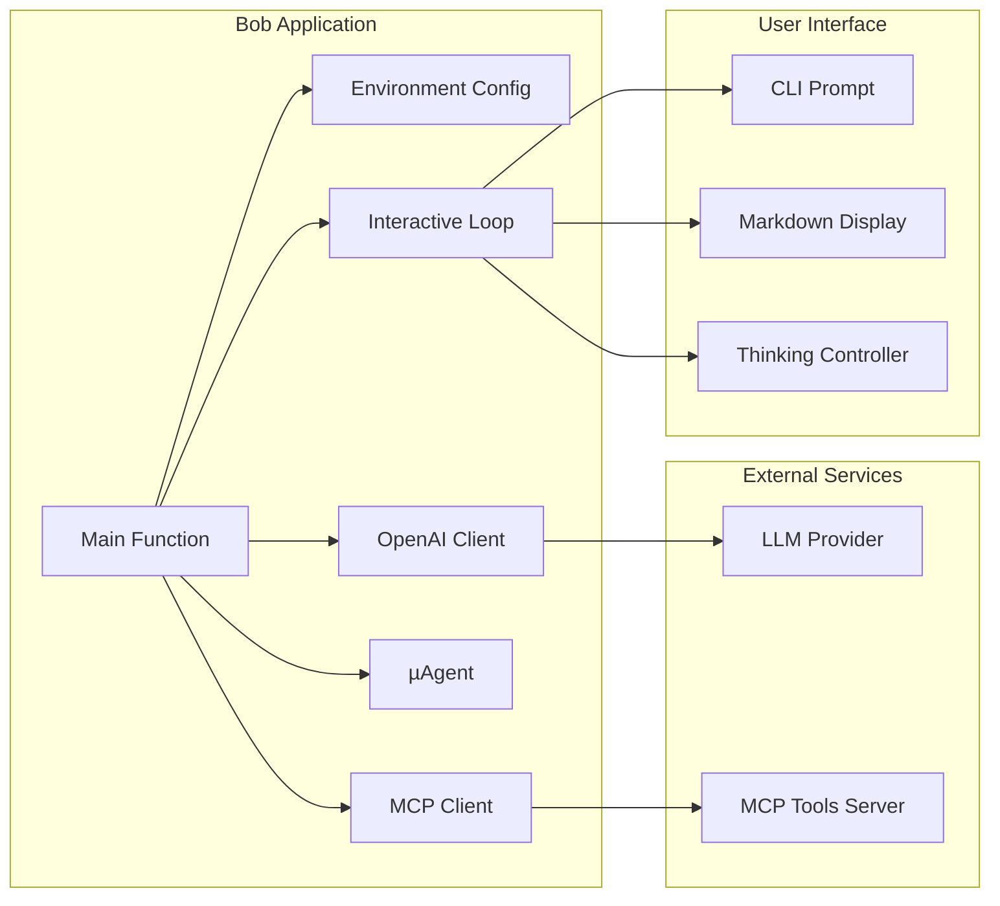
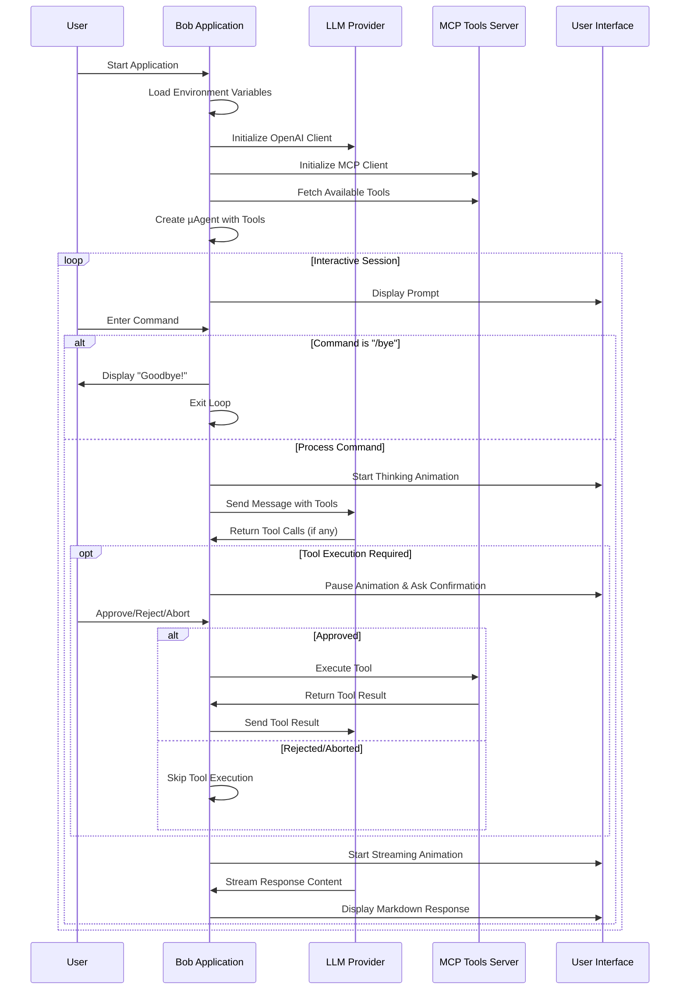
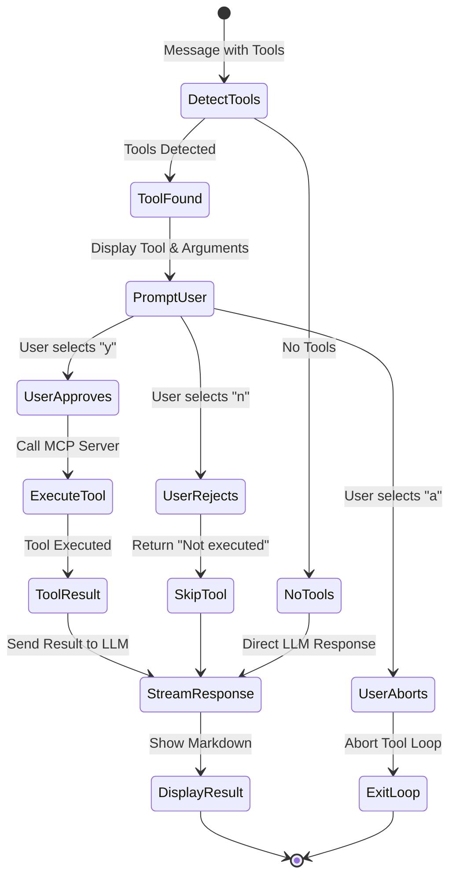

# Bob, µ-agent CLI

This directory contains a complete command-line application that demonstrates some capabilities of the micro-agent library.

## Interactive AI Assistant

The `cmd/bob/main.go` program demonstrates a more advanced implementation of µAgent, featuring an interactive AI assistant with MCP (Model Context Protocol) tool integration.

### Architecture Overview



### Component Architecture



### Program Flow



### Configuration

The application supports configuration through environment variables:

| Variable | Default Value | Description |
|----------|---------------|-------------|
| `PROVIDER_BASE_URL` | `http://localhost:12434/engines/llama.cpp/v1` | LLM provider base URL |
| `PROVIDER_API_KEY` | `""` | API key for the LLM provider |
| `MCP_HOST_URL` | `http://localhost:9011` | MCP tools server URL |
| `MODEL_ID` | `hf.co/menlo/jan-nano-gguf:q4_k_m` | Model identifier |
| `SYSTEM_MESSAGE` | Bob the Bot default message | System prompt for the AI assistant |

### Key Features

1. **Environment-based Configuration**: All connection parameters are configurable via environment variables with sensible defaults.

2. **MCP Tool Integration**: Connects to an MCP (Model Context Protocol) server to provide the AI with external tools and capabilities.

3. **Interactive User Confirmation**: Before executing any tool, the application asks for user confirmation with options to approve, reject, or abort.

4. **Real-time Streaming**: Responses are streamed in real-time with visual feedback through thinking and streaming controllers.

5. **Graceful Exit**: Users can type `/bye` to exit the application cleanly.

6. **Rich UI Feedback**: Uses colored output and animations to provide clear visual feedback during different stages of processing.

### Tool Execution Flow



### Prerequisites

**Start MCP Server**: Before running the Bob application, you must start an MCP (Model Context Protocol) server. The application expects an MCP server to be running at `http://localhost:9011` by default. This server provides external tools and capabilities that extend the AI's functionality beyond basic conversation.

Without a running MCP server, the application will fail to initialize properly since MCP tool integration is a core feature.

### Running the Application

```bash
# With default configuration
go run cmd/bob/main.go

# With custom configuration
PROVIDER_BASE_URL="https://api.openai.com/v1" \
PROVIDER_API_KEY="your-api-key" \
MODEL_ID="gpt-4" \
go run cmd/bob/main.go
```